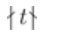

# Notes for _The Little Learner_

- https://www.thelittlelearner.com/
- https://github.com/themetaschemer/malt

## Setup

- [Racket](https://racket-lang.org/) 

- malt

  - install

    - raco pkg install malt

    - the [Git repository](https://github.com/themetaschemer/malt.git)

        - For MacOS and Linux: 

          ```
          git clone https://github.com/themetaschemer/malt.git
          cd malt
          make
          make install
          ```

        - For Windows:
          ```
          git clone https://github.com/themetaschemer/malt.git
          cd malt
          raco pkg install
          ```

  - Using in code
  
    ```scheme
    #lang racket
    (require malt)
    ```
  
    
  
  - Reference
  
    - [Documentation for Malt in the standard Racket format](https://docs.racket-lang.org/malt/index.html).


## Notation

See [notation.md](./notation.md)

## Laws | Rules

### Chapter 2

#### The Rule of Rank

A tensor's rank is the number of left square brackets before its leftmost scalar.

ch2:23

#### The Rule of Members and Elements

Non-empty lists have members and non-scalar tensors have elements.

ch2:37

#### The Rule of Uniform Shape

All elements of a tensor must have the same shape.

ch2:40

#### The Law of Rank and Shape

The rank of a tensor is equal to the length of its shape.

ch2:42

#### The Law of Simple Accumulator Passing

In a simple accumulator passing function definition every recursive function invocation is unwrapped, and the definition has at most one argument that **does not change**; an argument that **changes towards a true** base test; and another that **accumulates** a result.

ch2:46 Page 43

### The Law of Sum

For a tensor $ t $ with rank $ r > 0 $, the rank of $ (sum\ t) $ is $ r - 1 $.

ch3a:26 

### The Law of Revision

$$  \text{new } \theta_i = \theta_i - (\alpha \times \text{rate of change of loss w.r.t. } \theta_i)  $$

> w.r.t.: with respect to

$$  \theta_i \leftarrow \theta_i - \alpha \frac{\partial \text{Loss}}{\partial \theta_i}  $$

### The Rule of Hyperparameters

Every hyperparameter either is a scalar or has no value.

### Chapter 5

#### The Rule of Data Sets

In a data set `(xs, ys)`, both `xs` and `ys` must have the same number of elements. 

The elements of `xs`, however, can have a different shape from the elements of `ys`.

#### The Rule of Parameters (Final Version)

Every parameter is a tensor.

#### The Rule of *θ*

***θ*** is a list of parameters that can have different shapes.

### Chapter 6

#### The Rule of Batches

A batch of indices consists of random indices that are natural numbers smaller than `(tlen t)`

#### The Law of Batch Sizes

Each revision in stochastic gradient descent uses only a batch of size *batch-size* from the data set and the ranks of the tensors in the batch are the same as the ranks of the tensors in the data set.

ch6:38

### Chapter 7

#### The Law of Revisions

As long as we make sure that *gradient-descent* accepts an initial ***θ*** and results in a well-fitted ***θ***, any reasonable way of revising it from the first to the last revision is okay.

#### The Law of the Crazy “ates”

For any representation, the three “ates” are concerned with only one parameter and its accompaniments, and are not directly concerned with either ***θ*** or Θ.

## Chapter Guide

https://www.thelittlelearner.com/#ChapterGuide

## Erratta

https://www.thelittlelearner.com/#Errata

## Index


- 1
- 2

  - *scalar?* 32
  - [*e es* …] (where *e es* … are its elements) 33
  -  33
  - $ t|_i $ 36
  - *shape* 39
  - *scons* 40
  - $|ls|$ 41
  - rank 42

- 3a
- 3
- 4 Slippery Toys
  - ∇ 78
  - revise 80
  - map 81
  - gradient descent(draft) 89
- 5a Hyperactive Toys
  - **declare-hyper** 94
  - **with-hypers** 94
- 5 Toys for Target Practice

  - gradient-descent 99
  - `(quad-xs, quad-ys)` 100
  - `quad` 102
  - `(plane-xs, plane-ys)` 104
  - `plane` 105
  - • (`dot-product`) 106


- 6a Interlude III: The Shape of Things to Come
  - matrix 4
  - column matrix 6
  - row matrix 7
- 6 Random Toys (An Apple a Day)
  - samples 123
  - $ t||_b$ 124
  - batch-size 126
  - sampling-obj 127
- 7 Crazy Toys
  - gradient-descent 140
  - naked-gradient-descent 143
- 


